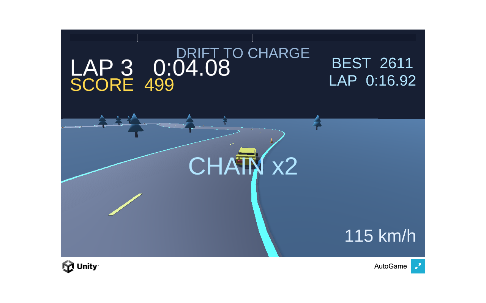

# DRIFT SURGE

One-touch drift-circuit time attack with a mini-turbo boost economy: hold a slide to charge SPARK/BLAZE/NOVA tiers, cash them as speed surges, chain them for FEVER. Low-poly neon, ghost racing, mobile-ready.

**▶ Play in browser:** https://masafykun.github.io/drift-surge/

## About
A small game built with Unity (6000.0.77f1). The C# source is under `src/`.
This repository also hosts a WebGL build, playable directly in the browser via GitHub Pages.
